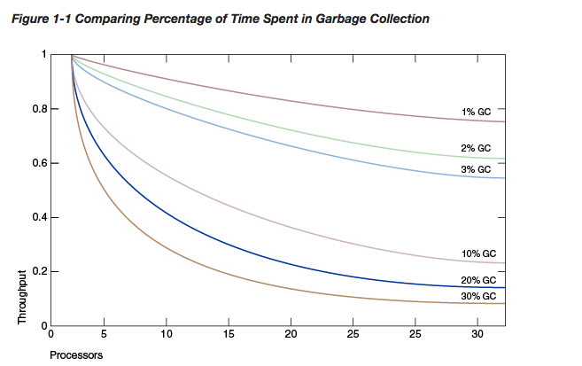
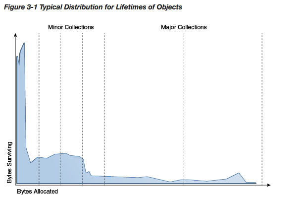
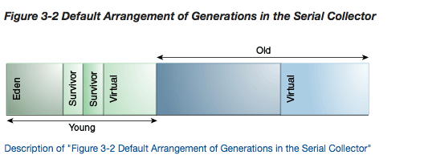
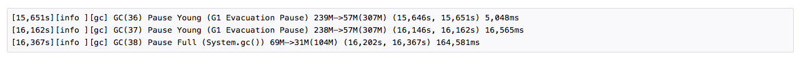
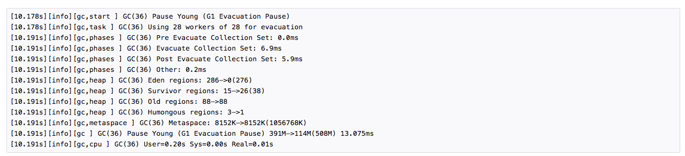
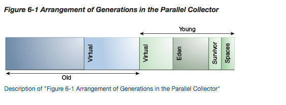
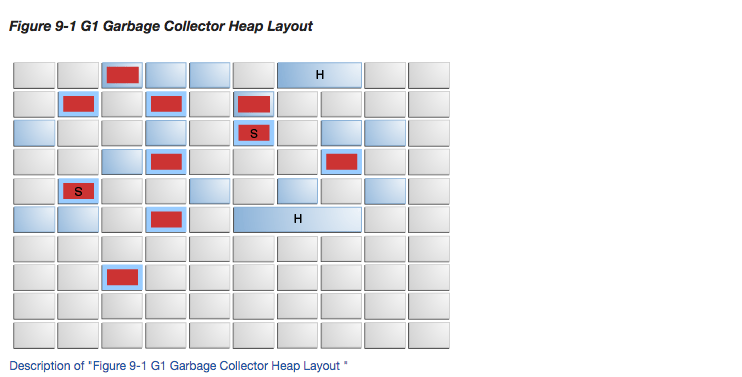

# HotSpot虚拟机调优
https://docs.oracle.com/javase/10/gctuning/preface.htm#JSGCT101

## 1 垃圾回收调优简介

各种各样的应用程序，小到桌面applet应用，大到web应用服务器，都是用了java平台进行开发。为了支持多样化的部署场景，HotSpotVM提供了
多样的垃圾回收器，用于满足不同的业务场景。JavaSE根据应用运行所在机器尽可能的选择最合适的垃圾回收器。但是对每一个应用来说这未必是
最优的选择。用户，开发人员，运维人员为了追求极致的性能可以显示的选择垃圾回收器并对某些垃圾回收器参数进行调优，已达到更高的性能要求。
这篇文档将提供一些信息帮助我们达成这一目标。

### 1.1 什么是垃圾回收器？

垃圾回收器自动管理应用对于动态内存的请求。

垃圾回收器通过以下操作进行动态内存管理：

* 向操作系统动态申请和释放内存
* 将申请到的内存资源根据应用的请求分发给应用程序
* 决定哪一部分的内存依旧被应用程序所使用
* 收回没有被占用的内存，以供应用程序再次使用

Java HotSpot垃圾回收器采用一下3种操作以改进垃圾回收效率：
* 分代清理，将注意力更加集中在那些可能包含可回收内存的区域
* 多线程回收，或者将一些耗时操作后台并行执行
* 尝试在垃圾回收之后，适用对象压缩技术，保留尽可能大的连续的内存

### 1.2 为什么选择垃圾回收器如此重要？

垃圾回收器的目的是解放应用程序开发人员，使他们不用再关心动态内存的管理。这从根本上消除了程序由于内存管理引起的相关bug。HotSpotVM
提供了一系列的垃圾回收算法供我们选择。

什么时候需要手动选择垃圾回收器？对于某些应用来说，答案是永远不需要。什么样的应用不需要手动选择垃圾回收器呢，当稳定的运行在默认的垃
圾回收器上时(垃圾回收的频率，以及持续时间都可以接受的情况下)。但是，很多情况下运行结果并非如此，例如一些需要处理大量数据(GB级)的
应用，多线程，访问高频的应用。

Amdahl's理论提出了大部分的工作不能够被完美的并行化。有一部分始终是串行的并且没有受益于并行处理。在目前的java平台上，有4中类型的
垃圾回收器可供选择，但是只有一种Serial GC使工作并行化以提升性能。有一点很重要就是尽可能的降低垃圾回收器的工作负载。将在下面的示例
详细描述。

下图展示了一个硬件资源可扩展的系统模型。红线描述了系统花费1%的时间用于垃圾回收，当cpu资源扩展到32核时，系统的吞吐量将下降20%左右。
如果花费10%的时间用于垃圾回收，当cpu资源扩展到32核时，吞吐量将下降75%。

上图展示了当系统很小(cpu资源使用较少的情况下)的时候，gc带来的系统吞吐量下降是微不足道的。对于大型系统来说，gc会成为系统吞吐量的一个
很大的瓶颈。小的gc改进可以取得巨大的性能受益。对于一个足够大型的系统，选择一个合适的垃圾回收器并且对参数进行调优是非常值得的。

## 2 Ergonomics

JVM自动根据平台选择默认的垃圾回收器，堆大小以及运行时编译器。不同的选择用于应对不同的应用场景。

这个章节讲述这些默认的选项和基于行为的调整。在本章节我们先使用默认的配置，后续的章节我们将展开更多的配置细节。

### 2.1 垃圾回收器，堆，运行时编译器默认选项

我们将如下配置定义为服务器类型的机器
* 2个或以上的物理处理器
* 2G以上物理内存

在服务器类型的机器上，默认配置如下：

* G1垃圾回收器
* 1/64初始堆容量
* 1/4最大堆容量
* 分层编译器 C1和C2

### 2.2 行为基准的调优

jvm调优通常为了实现两个目标：限制最大停顿时间，提升系统的吞吐量。当其中一个目标达成的时候，虚拟机尝试最大化提升第二个指标。但是通常
两个目标是无法同时达成的。

#### 限制最大停顿时间目标

停顿时间就是垃圾回收暂停整个应用，回收不再使用的内存空间的时间。目标是将这个持续时间降到最低。

平均的停顿时间和平均值的波动取决于垃圾回收器。如果平均暂定时间加上方差大于最大停顿时间目标，那么限制最大停顿时间的目标则没有达成。

最大停顿时间用过命令行参数 -XX:MaxGCPauseMillis=<nnn> 进行指定。垃圾回收器将通过调整堆大小以及其他垃圾回收相关参数以使得停顿
时间小于设置值。默认最大停顿时间不同的垃圾回收器值是不一样的。调整最大停顿时间可能会导致gc次数更加频繁，降低系统的吞吐量。优先场景下，
最大停顿时间的目标是无法实现的。

#### 吞吐量目标

吞吐量目标的衡量，取决于垃圾回收所用时间。

这个目标可以用过命令行参数 -XX:GCTimeRatio=nnn 进行执行。 -XX:GCTimeRatio=19 设置了一个不超过5%的时间用于垃圾回收的限制。

垃圾回收耗时包含了由垃圾回收引起的停顿时间。如果吞吐量目标没有达到，垃圾回收器可能会通过增加堆容量，以拉长垃圾回收之间的间隔。

#### Footprint
如果这两个目标同时满足，垃圾回收器将会减少堆容量知道其中一个目标不能被满足。最大最小堆容量可以通过-Xms=<nnn> and -Xmx=<mmm>
进行设置。

### 2.2 调优策略

堆容量会自动增加或者收缩以实现吞吐量的目标。

不需要重新设置堆最大容量，除非你明确知道将会使用超过默认最大堆容量。选择一个吞吐量目标就可以了。

应用系统的行为也可能导致堆的增长或者收缩。例如应用系统增加了申请堆空间的速率，堆容量将会增长以保持吞吐量目标。

如果堆增长到堆容量上限可是吞吐量目标依旧没有达到，那么说明堆的最大上限太小了，尽可能设置接近于操作系统物理内存容量的值，但是尽可能
不要使用交换空间。重启系统，如果吞吐量目标依旧无法达成，那么这个目标对于该操作系统平台来说太高了，无法达成。

如果吞吐量目标达成了，但是停顿时间过久，那么选定一个最大停顿时间的目标。选定最大停顿时间目标可能会导致吞吐量目标无法达成，所以需要
权衡一个可以同时达到的目标。

通常堆的大小始终在波动用于达到吞吐量以及停顿时间的目标，当找到了相对平衡的状态的时候也会如此。
吞吐量目标，最大停顿时间，使用尽可能少的内存资源3个目标相互竞争。

## 3 垃圾回收实现

JVM强大之处在于使得开发人员无需关心内存管理，以及垃圾回收。

然而，当垃圾回收成为系统瓶颈的时候，需要了解一些垃圾回收实现方面的内容。

### 3.1 分代垃圾回收

一个对象被视作垃圾并且他所占用的内存可以被回收当且仅当它已经无法被存活对象的引用(gc root)所抵达。

大部分直截了当的垃圾回收器直接迭代所有存货的对象，剩下的对象则都是垃圾。这个算法取决于存活对象的占比。当存活对象(不可回收对象)占比
很大的时候，这种方式就不太可取了。

JVM合并了多种垃圾回收算法，但它们使用了一个共同的技术：分代回收。原始的垃圾回收器每一次都会检测所有的存活对象，分代回收器基于一个
假说就是大部分的对象存活时间都相对较短，从而减少回收工作量。

下图展示了一般对象的生命周期。

可能有些系统对象的存活和上述图表中描述的有较大差异，但是绝大多数还是和上述图表保持一致的。最效率的垃圾回收，就是将绝大部分对象从年轻
代就回收掉。

### 3.2 分代

如何优化垃圾回收，对内存进行分代管理。垃圾回收出现在任何一个代，当这个代满了之后。

大量的对象创建时被分配在年轻代中，并且大部分也在年轻代被回收。当年轻代满了之后，将触发一次次要垃圾回收只用于回收年轻代当中的对象。
此次回收的成本和年轻代中存活对象数量成正比。通常在每一次次级回收之后，一部分存活的对象将被移动至老年代。最终老年代被填满，触发一次
主要回收，整个堆都将被扫描。主要回收的时间要比次级回收花费的时间要长得多因为需要扫描的对象也多了。下图展示了默认serial垃圾回收器
的分代情况。

年轻代包括Eden区和两个survival区。大部分对象在Eden区创建。其中一个survival区域永远是空闲的，用于存放gc之后存活的eden区以及
另一个survival区的对象。每次gc之后，eden区和正在使用的survival区将被清空。下一次gc时，两个survival区将被交换。存活对象在
survival区当中不停复制，直到达到一定的次数之后，存活对象将被拷贝到老年代。这个过程被称作晋升。

### 3.3 性能注意事项

垃圾回收最主要的度量就是吞吐量和延迟

* 吞吐量是在一段时间当中，没有用于gc的耗时所占百分比。
* 延迟反映了应用的响应能力。gc时应用是无法对外提供服务的。

用户对垃圾回收器会有着不同的要求。例如，有些观点认为衡量web服务器的度量应该是吞吐量，gc的停顿时间是可以被容忍的，可以当做网络延迟。
可是，在一个图形交互系统，很小的延迟都将显著地影响用户体验。

有一些用户对一些其他的事项比较在意。
Footprint，占用空间，在物理内存有限或者多进程的系统当中，希望可伸缩。
Promptness，速率，当一个对象不可达之后到真正回收之间的时间，对于分布式系统比较重要。

通常，对分代进行内存的分配，是以上各个度量之间的平衡。例如，增大年轻代的空间可以最大化吞吐量，可是对占用空间要求比较高，gc速率会下降，
gc时间会增加。

没有一个标准的比例用于对分代进行内存分配，这取决于应用内存使用情况以及用户的要求。因为虚拟机的默认垃圾回收器以及参数未必是最优的选择，
可以通过命令行参数进行修改。

### 3.4 吞吐量和占用空间的度量

对于一些特定的系统，吞吐量和占用空间是最优秀的度量。

例如，web服务器的吞吐量可以通过client load generator进行测试。

空间占用在Solaris操作系统上可以通过pmap命令查看。

gc耗时可以通过jvm自带工具查看。

详细的gc信息可以通过-verbose:gc参数进行打印。下面是一个示例：

上图展示了两次minorGC和一次System.gc()触发的FullGC。日志行起始于一个时间戳，该时间戳是系统已经运行的时间。随后的字段是日志的
级别以及日志的类型，再然后是gc的唯一标识，GC类型，触发GC的原因，GC前内存使用，GC后内存使用，以及堆的大小。

-verbose:gc是 -Xlog:gc命令的别名。-Xlog是HotSpot虚拟机调整日志的通用参数。想获取更多的gc信息，可以使用-Xlog:gc*。
下面是一个更加全面的日志示例

## 5 可选的垃圾回收器

### 5.1 Serial Collector

Serial Collector使用单线程处理所有的垃圾回收工作，由于没有线程间交互所以相对而言它进行垃圾回收的效率较高。

该垃圾回收器适用于单核机器，或者多核微系统(数据量少于100MB)。在某些操作系统上serial Collector被默认选择，或者通过
-XX:+UseSerialGC手动开启。

### 5.2 Parallel Collector

Parallel Collector是一个高吞吐量的垃圾回收器。它也是一个分代回收器。主要的区别在于它使用多线程进行垃圾回收。

该垃圾回收器适合多核，中等到大数据级的应用系统，通过-XX:+UseParallelGC手动开启。

并行压缩技术用于在fgc时进行多线程处理。该属性默认开启。可以通过-XX:-UseParallelOldGC将其关闭。

### 5.3 The Mostly Concurrent Collectors

Mostly Concurrent Collectors消耗更多的cpu资源。

* G1：适合大数据量多核应用。最长停顿时间被满足的概率更高，同时尽可能保持一个高的吞吐量。
* CMS：主要用于限制最长停顿时间，占用较多的cpu资源。从JDK9开始不再被推荐使用。

### 5.4 选择一个合适的垃圾回收器

除非你的应用有很严格的最长停顿时间的要求，否则应该先用默认配置启动应用。

如果需要的话，首先通过调整堆大小来改进性能。如果依旧不能满足要求，那么参考以下建议：

* 系统占用100MB以下的数据量，使用serial回收器-XX:+UseSerialGC。
* 系统单核并且没有最大停顿时间限制，使用serial回收器-XX:+UseSerialGC。
* 系统性能优先且没有最长停顿时间的约束，使用parallel回收器-XX:+UseParallelGC。
* 响应时长要求超过了吞吐量，最长停顿时间必须在1秒以内，使用G1回收器-XX:+UseG1GC。

上述建议只是一个调优的开始，系统性能取决于堆的设置，数据量大小，cpu核数和运行速度。停顿时间对以上因素尤其敏感，所以一秒的阈值也只是
一个近似值。Parallel collector可能会引起1秒以上的GC。

如果推荐的垃圾回收器不够理想，先调整堆的大小以达到目标。如果运行状态不理想，尝试另一个垃圾回收器。
原则上是，使用concurrent collector减少最长gc时间，使用parallel collector增加吞吐量。

## 6.Parallel 并行垃圾回收器

并行垃圾回收器(专注于提升吞吐量)和Serial垃圾回收器类似是一个分代回收器。主要的区别就在于并行垃圾回收器使用多线程进行工作。
使用参数-XX:+UseParallelGC进行开启，默认情况下，minorGC和majorGC都将使用并行的方式进行收集。

### 6.1 并行垃圾回收器的使用的线程数

当物理机核数大于8的时候，该回收器使用一个固定的比例的线程数，大约是5/8。如果物理机核数小于8，那么使用的线程数和物理机核数相等。
在单核系统上，parallel collector表现可能没有serial collector好，因为在parallel collector当中有一些并行的执行流，例如
同步代码块，会影响性能。但是在中到大数据量的系统当中，双核使用并行垃圾回收器的性能就超越了serial回收器，核数越多越明显。

### 6.2 并行垃圾回收器的分代布局

### 6.3 并行垃圾回收器Ergonomics

当开启-XX:+UseParallelGC并行垃圾回收器之后，允许你指定特殊参数达到自动调优，低级的参数设置例如指定分代大小将不起效果。

#### 6.3.1 并行垃圾回收器可选参数

可供指定的有最大停顿时间，吞吐量以及内存占用量

* -XX:MaxGCPauseMillis=<N> 指定期望的最大停顿时间。堆大小以及其他gc相关参数将被自动调整以尽可能满足这个条件。但是这个条件无法
被保证满足。该参数没有默认值，设置该参数将导致吞吐量的下降。
* -XX:GCTimeRatio=<N> 将gc所占应用运行时间比设置为1/1+N。默认值N为99，即期望花费低于1%的时间用于gc。
* -Xmx<N>用于指定最大堆内存。当上述指标都达到时候，虚拟机会尽可能降低堆内存的使用。

#### 6.3.2 并行垃圾回收器目标优先级

最大停顿时间将首要满足，其次是吞吐量。两者都满足的前提下，才会考虑内存使用量的问题。

#### 6.3.3 并集垃圾回收器的堆容量调整

统计数据例如停顿时间在每一次gc之后被更新。

更新统计数据之后，将确定目标是否被满足，以及分代堆大小是否需要进行调整。这里有一个特例就是显示的调用System.gc()方法不会计入统计
也不会产生自动的堆调节。

堆的大小将根据一个比例进行扩张以及收缩。扩张和收缩的比例是不同的，通常扩张的比例要比搜索的比例大一些。默认情况下，按照20%的比例进行
扩张，以5%进行收缩。可以通过参数-XX:YoungGenerationSizeIncrement=<Y> 调整年轻代的扩张比例以及
-XX:TenuredGenerationSizeIncrement=<T> 调整老年的扩张比例。-XX:AdaptiveSizeDecrementScaleFactor=<D>参数用于调整
扩张与收缩比例之间的比例。

如果最大停顿时间目标没有满足，同一时间点只有一个分代堆的内存会被收缩。如果两个分代的垃圾回收停顿时间都超过了最大停顿时间，那么使用
更长停顿时间的分代区将会优先收缩。

如果吞吐量目标没有被满足，两个分代的内存都将被扩张。扩张的比例与gc停顿时间的贡献度有直接关系。如果年轻代贡献了25%gc时间，且年轻代
完整的扩张比例为20%，那么年轻代将由于gc时间调整扩张5%。

#### 6.3.4 并集垃圾回收器的默认堆大小

除非显示地设定了堆最大容量，堆大小是根据机器物理内存计算出来的。默认堆最大值为1/4机器物理内存，初始为1/64物理内存。分配给年轻代最大
堆容量为1/3堆大小。

可以通过-Xms和-Xmx设置最大最小堆容量。

如果明确地知道应用运行在多少内存下合适，那么可以将-Xms和-Xmx设置成同样大小。如果不知道的话可以让jvm先用默认参数进行启动，让它自行
扩展到一个平衡点。

其他一些参数可能会影响到默认值的设置，可以通过以下命令进行观察
`java -XX:+PrintFlagsFinal <GC options> -version | grep MaxHeapSize`

### 6.4 过量的gc时间以及OutOfMemoryError

当使用过量的时间用于gc的话，jvm会抛出OutOfMemoryError错误。如果真的有必要的话，可以通过-XX:-UseGCOverheadLimit将这个特性关闭

### 6.5 Parallel Collector度量

与Serial垃圾回收器雷同。

## 7 并发垃圾回收器 Mostly Concurrent Collectors

并发回收器并发地执行垃圾回收任务。HotSpot包含两种并发回收器，CMS与G1.

### 7.1 并发垃圾回收器的代价

并发垃圾回收器使用cpu资源换取更短的垃圾回收停顿时间。

可见的最大开销就是在使用多线程执行并发任务的时候。一个N核的系统，并发任务阶段使用K/N核资源，其中1<=K<=ceiling(N/4)。
因此，并发回收器的停顿时间会比较短，但是会吞吐量会略微受到影响。

在一个多核系统上，执行垃圾收集并发任务时并发回收器不会暂停整个应用。通常需要停顿的时间较短，然后很快便有一部分cpu资源供应用使用，
但是整个应用可能会略微变慢，尤其在应用使用整个cpu资源的情况下。当N增长时，gc占用的cpu资源占整体cpu资源比例减少，从并发回收器当中
获得的收益更大。

在并发阶段，至少需要使用一个cpu资源，所以并发回收器在单核操作系统上没有什么收益。

## 9 G1垃圾回收器

## 9.1 G1回收器简介

G1回收器用于多核大数据集应用。它将尽可能的满足最大停顿时长要求，并且在满足上述要求下尽可能的提高吞吐量。G1主要致力于寻找一个最优的
平衡，适用于以下场景：

* 堆容量高达10G以上，50%的堆的长期存活对象。
* 内存分配和晋升耗时区间很广
* 堆碎片很多
* 避免长时间gc

G1用于替换CMS回收器

## 9.2 开启G1回收器

G1回收器是默认垃圾回收器，所以一般不需要做额外的操作。可以通过 -XX:+UseG1GC显示开启。

## 9.3 基本概念

G1是一个分代，增量，并行，并发，stop-the-world，稀疏的垃圾回收器，它在所有的stop-the-world阶段都对停顿时间进行监控。和其他
回收器类似，G1也分年轻代和老年代。回收空间的工作主要集中在年轻代，这最有效率。

有一些操作依旧还是在stop-the-world进行，以提升整体的吞吐量。其他有可能造成应用长时间停顿的操作例如global marking操作和应用程序
并发并行执行。为了保证停顿时间较短，G1分步增量进行并行进行垃圾回收。G1通过之前gc相关信息，创建一个垃圾回收模型。使用该模型决定停顿
时间内的工作量。G1优先回收最有效率的区域(经常被填满的区域)。

垃圾回收区域幸存的对象将被压缩，移动至一个新的区域。在这个操作之后，之前那块区域便完全可用了，不存在碎片。

G1不是一个实时的回收器。它主要限制单次停顿时长不超过预定值，不过也不是绝对的。

## 9.3.1 堆布局

---------------------------------------------------------------------------------------------------------

# java虚拟机规范
https://docs.oracle.com/javase/specs/jvms/se10/html/index.html

## chapter 2. 虚拟机结构

这篇文档提及的虚拟机是一个抽象的概念，并不特指某一个具体的虚拟机实现。

想要实现一个java虚拟机，你只需要正确的读取字节码文件然后将它转化成虚拟机指令。实现的具体细节将不被在本文中被提及，避免约束了实现者
的创造力。例如运行时数据内存结构，垃圾回收算法，虚拟机指令优化留给实现者去完成。

### 2.1 class文件格式

虚拟机执行的代码是经过编译后的二进制代码，它与操作系统无关，通常(但不是必须)以文件形式存储，如同我们所知的class文件类型。class文件
描述了一个class或者接口。

在第四章节中将详细讲解class文件格式

### 2.2 数据类型

和java数据类型类似，java虚拟机操作也支持两种数据类型：基本数据类型和引用数据类型。它们可以被存储在变量中，通过参数传参，通过方法
返回值进行返回，以及进行计算操作。

虚拟机期望所有的类型检查都在运行前完成，一般在通过编译器完成，不需要虚拟机自己去做。

java虚拟机包含明确的对对象的支持。对象是一个动态分配的类实例或者一个数组。对象的引用被认为拥有一个虚拟机当中的reference类型。
reference类型的值可以被想象成对象的指针。一个对象可以拥有多个引用。对象总是通过引用进行操作。

### 2.3 基本类型和值

java虚拟机当中的基本类型包括数字类型，boolean类型以及returnAddress类型

returnAddress类型的值是虚拟机指令码的指针。它没有对应的java数据类型，并且在运行时无法被篡改。

### 2.4 引用的类型和值
引用的类型有三种：类类型，接口类型和数组类型。

数组类型引用包括了素组当中一维元素的类型，但不包括数组的长度。一维元素本身可以是一个数组，所以数组当中可以嵌套数组，但是在嵌套的数组
当中必须找到一个非数组类型的元素。最终数组元素的类型可以是基本数据类型，类类型，接口类型。

### 2.5 运行时数据区域划分

java虚拟机定义了多个运行时的数据区域用于运行程序。有一些区域是随着虚拟机启动而创建，关闭而销毁，有的是和线程生命周期相关。

#### 2.5.1 程序计数器(CPU)

#### 2.5.2 虚拟机栈

每一个线程拥有一个私有的虚拟机栈，随着线程创建而创建。虚拟机栈和C语言栈约定类似，存放局部变量的引用。java虚拟机栈不需要连续。

虚拟机规范允许虚拟机栈使用固定内存或者进行动态扩展。

虚拟机栈可能引发的报错：
* 如果线程需要超过栈允许的固定内存大小，则抛出StackOverflowError
* 如果栈内存大小允许扩展，扩展申请不到内存了，或者初始化的时候申请不到内存了抛出OutOfMemoryError

#### 2.5.3 堆
堆被各个线程所共享。类实例以及数组对象存放在堆中。

堆在虚拟机启动时被创建。堆当中的对象被储管理系统自动回收。堆大小可以动态扩展。堆内存不需要连续。

堆可能引发的异常报错：
* 如果程序需要申请超过存储管理系统可用的内存时，抛出OutOfMemoryError

#### 2.5.4 方法区
方法区也是被所有的线程所共享。方法区按照类的结构，存放运行时常量池，属性，方法，方法代码，构造函数。
方法区在虚拟机启动时被创建。方法区逻辑上属于堆的一部分，作为简单的虚拟机实现可以不对方法区进行垃圾回收以及压缩处理。

#### 2.5.5 常量池

#### 2.5.6 本地方法栈

